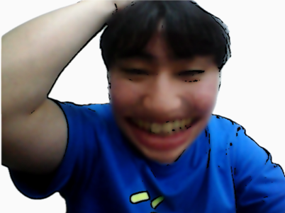
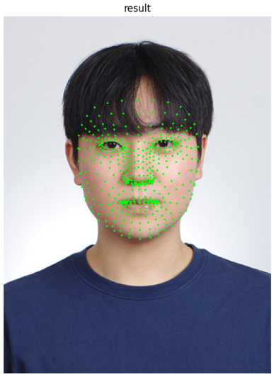
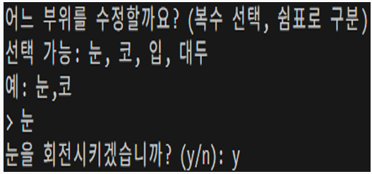

# CustomFace

웹캠으로 촬영한 얼굴 사진을 실시간으로 분석해, 눈·코·입·얼굴형 등 원하는 부위를 과장하고
카툰(만화) 스타일로 변환해주는 캐리커처 생성기입니다. 동국대학교 Human-Computer Interaction 수업 팀 프로젝트로 시작되었습니다.

## 데모

<p align="center">
  
</p>

<p align="center"><sub>눈 부위 확대·회전과 카툰 효과가 함께 적용된 최종 결과물</sub></p>

## 주요 기능

- **웹캠 캡처 / 파일 업로드**: 실시간 웹캠 스트리밍 중 얼굴이 검출되면 캡처하거나, 기존 이미지 파일을 업로드
- **얼굴 랜드마크 추출**: MediaPipe Face Mesh로 468개 얼굴 랜드마크 좌표 추출
- **부위별 왜곡**: 눈/코/입/얼굴형을 선택적으로 확대·축소 (Thin Plate Spline 워핑), 눈 90도 회전 옵션
- **색상 전처리**: 히스토그램 평활화(Equalization) / 스트레칭(Stretching) 두 방식으로 밝기·채도 보정
- **카툰 효과**: 엣지 검출 + 양방향 필터를 조합한 만화 스타일 변환
- **감정 일관성 평가**: FER로 원본과 결과물의 표정을 비교해, 왜곡 후에도 원래 표정이 잘 유지되는지 코사인 유사도로 점수화
- **CLI / GUI 두 가지 실행 방식** 지원

## 기술 스택

| 분류 | 기술 |
|---|---|
| 영상 처리 | OpenCV (opencv-contrib-python) |
| 얼굴 랜드마크 | MediaPipe Face Mesh |
| 감정 인식 | FER (Facial Expression Recognition) |
| GUI | PyQt5 |
| 수치 연산 | NumPy, scikit-learn |
| 시각화 (CLI) | Matplotlib |

## 파이프라인 구조

```
웹캠 캡처 / 이미지 업로드
        │
        ▼
색상 전처리 (histogram equalization / stretching)  ─ preprocessing_eq.py, preprocessing_st.py, color_utils.py
        │
        ▼
얼굴 랜드마크 추출 (MediaPipe Face Mesh)            ─ landmark_extraction.py
        │
        ▼
선택 부위 왜곡 (TPS 워핑 / 리사이즈-블렌딩 / 회전)   ─ modification.py
        │
        ▼
카툰 효과 적용 (엣지 검출 + 양방향 필터)             ─ cartoon.py
        │
        ▼
감정 일관성 점수 계산 (FER + 코사인 유사도)          ─ test.py
```

<p align="center">
  
</p>

<p align="center"><sub>MediaPipe Face Mesh로 추출한 468개 얼굴 랜드마크 (녹색 점) — 이 좌표를 기준으로 부위별 왜곡이 적용된다</sub></p>

## 프로젝트 구조

```
CustomFace/
├── main.py                    # CLI 진입점 (전체 파이프라인 순차 실행)
├── app.py                     # PyQt5 GUI 진입점
├── pipeline.py                # GUI에서 호출하는 파이프라인 함수 (run_pipeline)
├── capture.py                 # 웹캠 캡처 (얼굴 검출 대기)
├── user_input.py              # CLI 터미널 입력 처리
├── landmark_extraction.py     # MediaPipe 기반 얼굴 랜드마크 추출
├── modification.py            # 부위별 왜곡(TPS 워핑, 회전 등)
├── color_utils.py             # 색상 전처리 공통 로직
├── preprocessing_eq.py        # 히스토그램 평활화 전처리
├── preprocessing_st.py        # 히스토그램 스트레칭 전처리
├── cartoon.py                 # 카툰 효과
├── test.py                    # 감정 일관성 점수 계산 (FER)
├── requirements.txt
└── assets/                    # 실행 중 생성되는 캡처/결과 이미지 (git에는 포함하지 않음)
```

## 설치 및 실행

### 1. 환경 준비

MediaPipe, PyQt5, TensorFlow(FER 의존성)의 호환성을 위해 **Python 3.9 ~ 3.10** 사용을 권장합니다.

```bash
python -m venv venv
# Windows
venv\Scripts\activate
# macOS / Linux
source venv/bin/activate

pip install -r requirements.txt
```

### 2. CLI로 실행

```bash
python main.py
```

1. 웹캠 화면에서 얼굴이 인식되면 아무 키나 눌러 캡처 (Esc는 취소)
2. 터미널 안내에 따라 수정할 부위(눈, 코, 입, 대두)를 쉼표로 입력
3. 히스토그램 평활화 결과와 스트레칭 결과 중 감정 일관성 점수가 더 높은 쪽이 출력

<p align="center">
  
</p>

<p align="center"><sub>터미널에서 수정할 부위와 눈 회전 여부를 입력받는 화면</sub></p>

### 3. GUI로 실행

```bash
python app.py
```

- **파일 업로드** 또는 **사진 촬영** 버튼으로 이미지 입력
- 체크박스로 왜곡할 부위와 눈 회전 여부 선택 후 **생성/적용** 클릭

## 참고 사항

- `cv2.createThinPlateSplineShapeTransformer`는 `opencv-contrib-python` 패키지가 설치되어 있어야 동작합니다 (`opencv-python`만으로는 동작하지 않음).
- `assets/origin`, `assets/result`는 실행 시 자동 생성되는 캡처·결과 이미지 폴더로, 개인 얼굴 사진이 포함될 수 있어 `.gitignore`로 저장소에서 제외했습니다.
